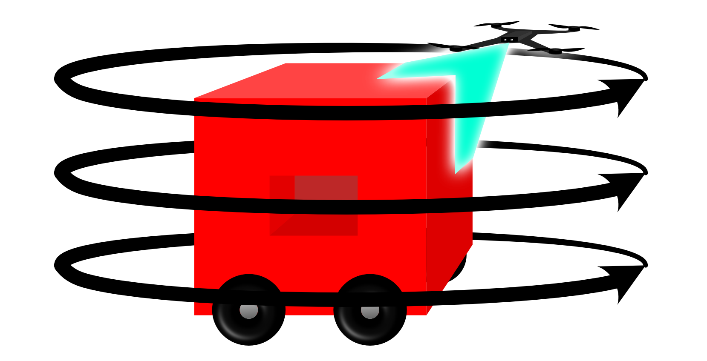
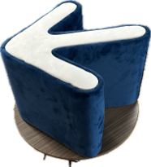
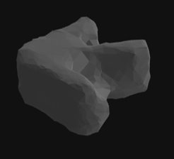
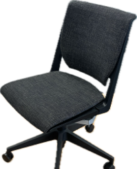
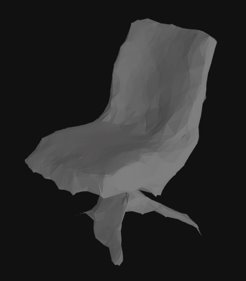
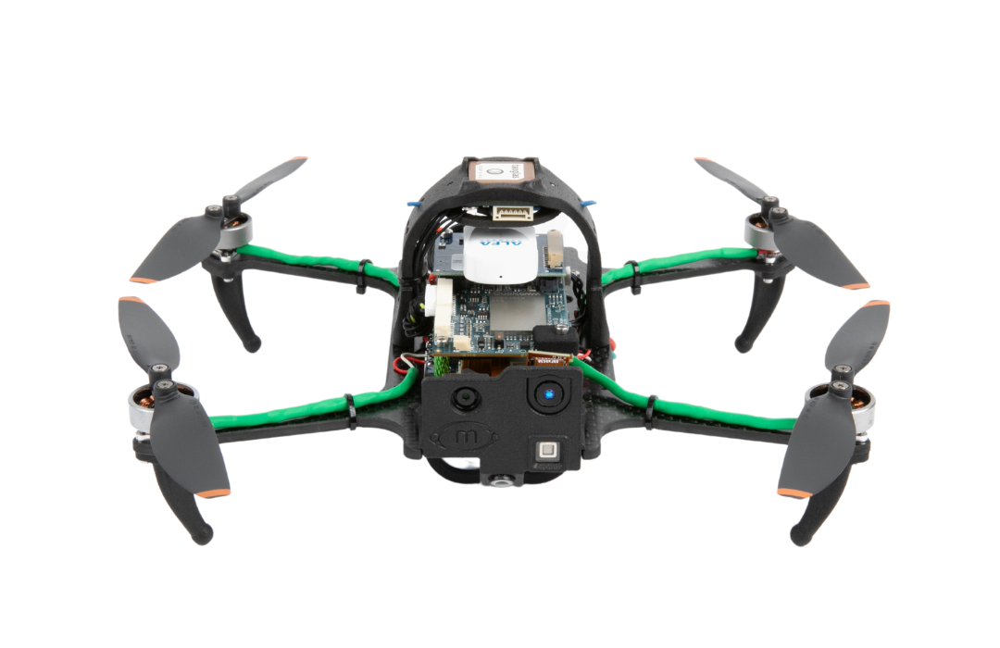

# Introduction
AeroPrint is a student-led research project designed to explore real-world application of the [digital thread](https://en.wikipedia.org/wiki/Digital_thread). AeroPrint employs a small [UAS](https://www.faa.gov/uas) to perform automated 3D digital scanning of objects. Using a [ToF (Time of Flight) sensor](https://en.wikipedia.org/wiki/Time-of-flight_camera), the AeroPrint drone performs a systematic scan of a given object by flying an automatically generated flight plan. 

AeroPrint currently acts as a proof of concept for the idea of automating the process of digitization using UAS. 

## Capabilities
Currently, AeroPrint implements rudimentary path planning and 3D localization techniques to achieve basic functionality. The product does not limit scans based on volume, but has certain limitations due to hardware and software implementation. 
### Path Planning
In the current AeroPrint software release, the flight path is defined by a set of user-defined parameters such as the height of the object, the height of the base of the object (for objects propped above the ground), and the drone's starting radius from the center of the object.

The drone will begin flight slightly higher than the object based on the input parameters which allows data to be captured of the top surface of the object and the sides. After revolving around the object and capturing incremental ToF data, the drone will drop to a level adjacent to the middle of the object and do the same. Finally, the drone will drop to a low level to capture the base of the object. 

### Data Collection
AeroPrint captures several types of data that can either be used as-is, or further processed for more detailed modeling or texturing. Raw [pointcloud](https://en.wikipedia.org/wiki/Point_cloud) files are captured incrementally, which AeroPrint uses to process a combined and filtered set of points that represent the model. Then, as a final file output, AeroPrint processes a solid triangle mesh which can be used in CAD software, 3d printing, or other means of analysis.
|Object|Mesh|
|:---:|:---:|
|||
|||

### 3D Printing
AeroPrint takes seversl steps towards completing the 'digital thread' by automating the process not only of collecting and processing data, but by automatically slicing and 3D printing replica objects. The current version of AeroPrint utilizes the [Slic3r](https://slic3r.org) library to automate the processing of meshes into code for a 3d printer.

The printer chosen for integration with AeroPrint is the [Prusa Mk4](https://www.prusa3d.com) due to its open-source compatibility and reliability. Using Prusa's API, AeroPrint is able to automatically establish a connection to a networked printer and initiate prints.

## Hardware
The most crucial hardware element for AeroPrint is the drone, which is the [ModalAI Starling](https://docs.modalai.com/starling/). The Starling is chosen due to its open-source compatibility, with [Ubuntu](https://ubuntu.com) as its standard OS, its built-in ToF sensor, and its commercial availability. 

Starling boasts an 8-core Qualcomm processor with 8GB memory and built-in hardware-accelerated neural processing capabilities. The advanced technical capabilities of the [VOXL 2](https://www.modalai.com/products/voxl-2) which powers Starling, it is capable of much more advanced flight and data optimization than AeroPrint currently takes advantage of. 

