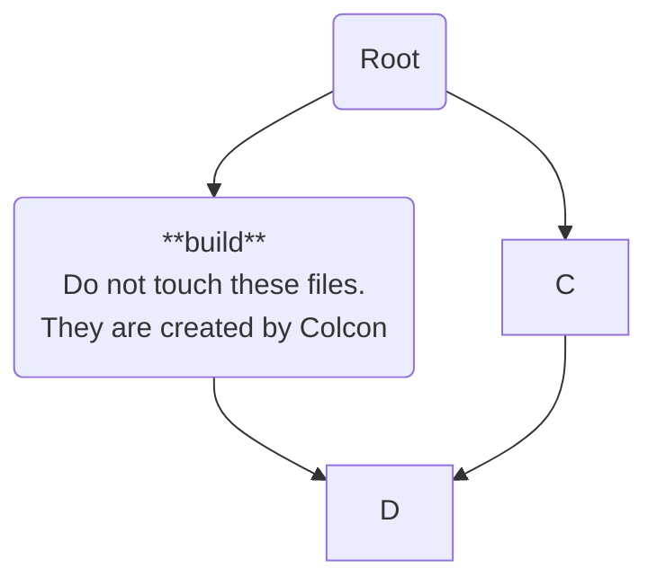

# Aeroprint Project Resources

## Installation

Run this line to perform a full installation of this library and ROS2 Foxy.

``` bash
sudo curl -sSL https://github.com/kuederleR/aeroprint/raw/master/aeroprint_setup.sh | sh
```

If you do not have curl installed, run ```sudo apt install curl```.

## Running Pre-Release Applications

To run the pre-release version of the application, run this line in an Ubuntu terminal (working in 18, 20, 22).

``` bash
sudo snap install --devmode --edge aeroprint
```

If you do not have snap installed, run ```sudo apt install snap```.

## Aeroprint File Organization



