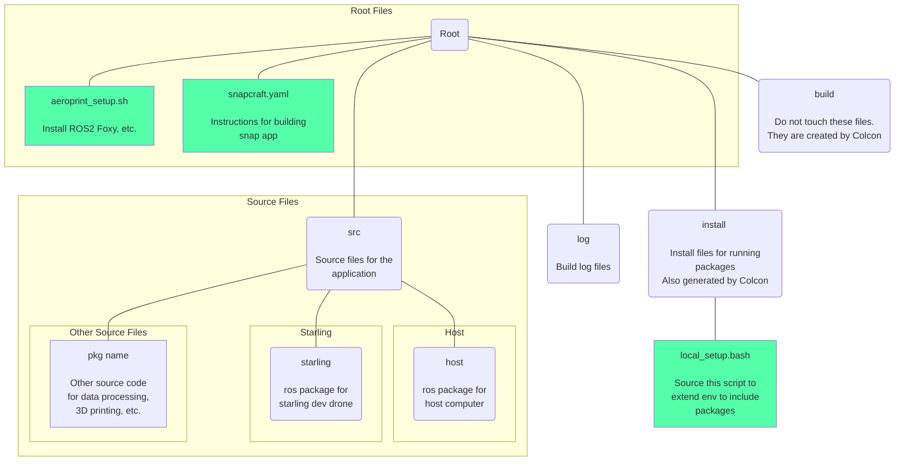
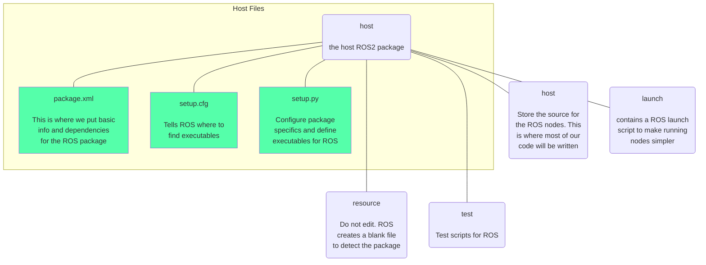

# Aeroprint Project Resources

## Installation

Run this line to perform a full installation of this library and ROS2 Foxy.

``` bash
sudo curl -sSL https://github.com/kuederleR/aeroprint/raw/master/aeroprint_setup.sh | sh
```

If you do not have curl installed, run ```sudo apt install curl```.

## Running Pre-Release Applications

To install the pre-release version of the application, run this line in an Ubuntu terminal (working in 18, 20, 22).

``` bash
sudo snap install --devmode --edge aeroprint
```

If you do not have snap installed, run ```sudo apt install snap```.

Run ```aeroprint.base``` for the base code or ```aeroprint.starling``` to run the UAV code.

<p style="font-size:0.8rem">Note: the starling is not yet able to run snap due to file system incompatibility.</p>

## Aeroprint File Organization



## ROS Package Layout
Ros packages have a particular layout, which is automatically generated by [ROS2](https://docs.ros.org/en/foxy/How-To-Guides/Developing-a-ROS-2-Package.html#creating-a-package). For this project, we will be using ament_python for building our packages. This is specified when creating a ROS2 package. The packages, host and starling, have both been created using ROS2's pkg create feature, with the addition of a [launch](https://docs.ros.org/en/foxy/How-To-Guides/Launch-file-different-formats.html) folder.

Both the starling and host packages have approximately identical layouts. Below is a tree representing the layout of the host package. 

