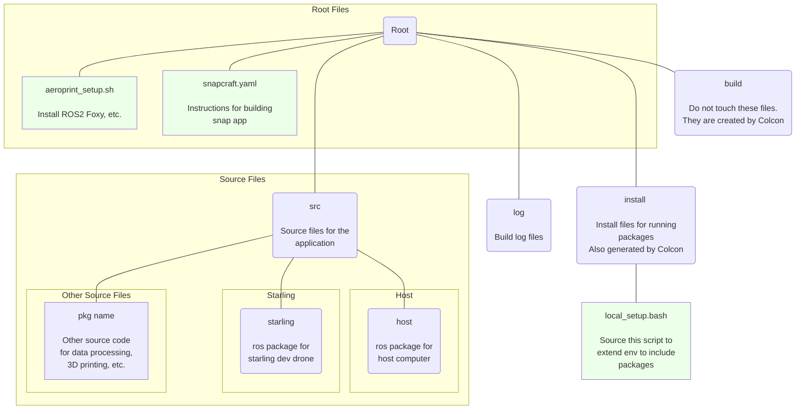
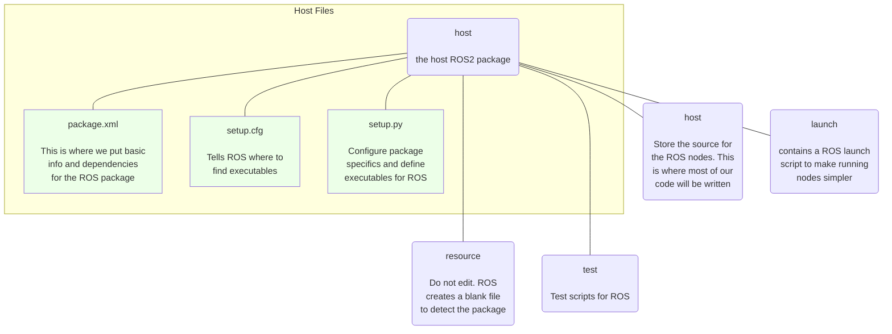

# Aeroprint Project Resources

## Getting Started

### Reading Materials

Before doing any work either on this project, or a fork of this project, there is a set of materials that are very strongly suggested reads. To familiarize yourself with both the hardware and software involved in this project,

please **read thoroughly** the following materials:

- (optional) [git chapter 2](https://git-scm.com/book/en/v2/Git-Basics-Getting-a-Git-Repository)
    - Read this Git Basics chapter if you have little or no experience with git.
- [ROS 2 Foxy Documentation](https://docs.ros.org/en/foxy/index.html)
    - You do not need to go through the install or setup tutorials unless you really want to. The resources in this repository will do all of this for you. However, do read the docs to familiarize yourself with ROS 2.
- [ModalAI Starling Hardware Overview](https://docs.modalai.com/starling-v2-hardware-overview/)
    - If you plan to do any work whatsoever with the Starling, you **must** familiarize yourself with the hardware.
- [ModalAI VOXL Developer Bootcamp](https://docs.modalai.com/voxl-developer-bootcamp/)
    - Do not work on the Starling or any of its software prior to total completion of the VOXL Developer Bootcamp.
- [ModalAI VOXL SDK Docs](https://docs.modalai.com/voxl-sdk/)
    - Prior to any software development related to the Starling, read the VOXL SDK documentation. The [Building ROS2 Nodes](https://docs.modalai.com/building-ros2-nodes/) section will be especially critical to this project and reading the ambedded video is highly recommended. 

This project relies heavily on ROS 2 and the VOXL SDK. Both of these libraries are best supported in Ubuntu 20.04. Because of this, development and testing should be done within an Ubuntu 20.04 environment. We should all have a common build of this OS that is platform agnostic. TODO: build Ubuntu 20.04 runtime for dev and testing. 

Also, it is recommended that you [install Visual Studio Code](https://code.visualstudio.com/download) to improve your development efficiency. VS Code has an excellent [tool for using git](https://code.visualstudio.com/docs/sourcecontrol/overview) if you prefer not to use the CLI.

### Installation and Starting Development
Refer to this repository's [Wiki](https://github.com/kuederleR/aeroprint/wiki) for guidance during AeroPrint development. The suggested order for getting started is as follws:
1) [Installation](https://github.com/kuederleR/aeroprint/wiki/Installation)
2) [Contributing](https://github.com/kuederleR/aeroprint/wiki/Contributing)
3) [Running ROS Packages](https://github.com/kuederleR/aeroprint/wiki/Running-ROS-Packages)


## Running Pre-Release Applications

To install the pre-release version of the application, run this line in an Ubuntu terminal (working in 18, 20, 22).

``` bash
sudo snap install --devmode --edge aeroprint
```

If you do not have snap installed, run ```sudo apt install snapd```.

Run ```aeroprint.base``` for the base code or ```aeroprint.starling``` to run the UAV code.

<p style="font-size:0.8rem">Note: the starling is not yet able to run snap due to file system incompatibility.</p>

## Aeroprint File Organization



## ROS Package Layout
Ros packages have a particular layout, which is automatically generated by [ROS2](https://docs.ros.org/en/foxy/How-To-Guides/Developing-a-ROS-2-Package.html#creating-a-package). For this project, we will be using ament_python for building our packages. This is specified when creating a ROS2 package. The packages, host and starling, have both been created using ROS2's pkg create feature, with the addition of a [launch](https://docs.ros.org/en/foxy/How-To-Guides/Launch-file-different-formats.html) folder.

Both the starling and host packages have approximately identical layouts. Below is a tree representing the layout of the host package. 


## Snap App Deployment

The ```snapcraft.yaml``` file in this repository allows [snap](https://snapcraft.io/) to automatically build and deploy a lightweight application. This file specifies details about the app and provides commands to run upon app execution. 

Currently, snap is automatically building new versions of the aeroprint application when new changes are pushed to the project's master branch. This app is published to the [edge channel](https://snapcraft.io/docs/channels), as it is in early development.

The benefit of using snap is that it provides a simple way to deploy the application on any machine running linux. Canonical provides a base snap that provides a minimal Ubuntu 20 runtime, allowing our ROS app to run on systems not running Ubuntu 20.04.
 
## Essential Resources
- [Slides on using ROS 2 with VOXL 2](https://static.sched.com/hosted_files/px4summit2023/e8/James%20Strawson%20-%20How%20to%20fly%20a%20figure%208%20using%20ROS2%20on%20the%20new%20VOXL%202%20Starling%20PX4%20Autonomy%20Dev%20Kit.pdf)
- [PX4 message docs](https://docs.px4.io/main/en/msg_docs/)
- [Using ROS2 with VOXL 2](https://docs.modalai.com/ros2-installation-voxl2/)
